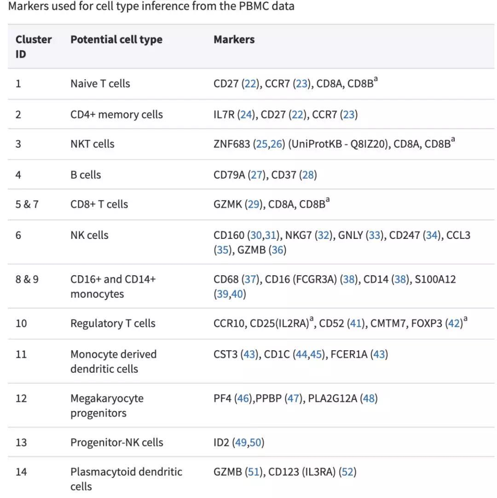

# 211021

## integration confirmation

## Clusters Info

.png>)

可以发现**cluster2，12，14，15，16**是patient-enrich的，需要重点研究，特别是**cluster2**，ERM和PDR PBMC占了大部分，仅有少量的Health PBMC，可能是有Biomarker的存在

.png>)

按照样本名来分类也可以看到Cluster2中以ERM和PDR PBMC为主

## Annotation

* CD4+ T cell

.png>)

* CD8+ T cell

.png>)

* NK cell

.png>)

* Monocyte

.png>)

* B cell

.png>)

