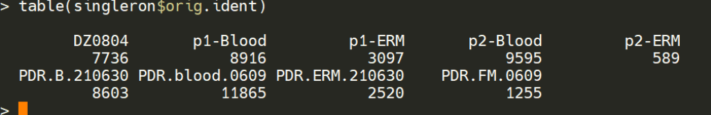
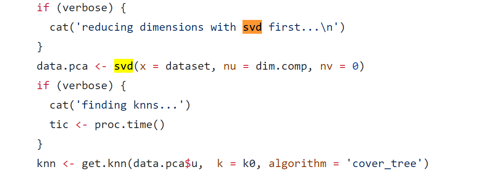
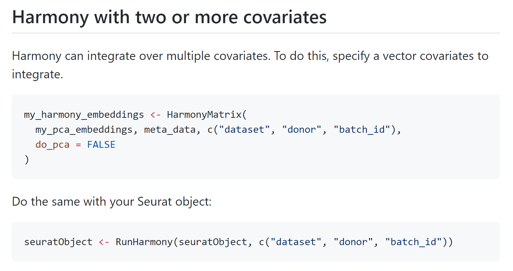
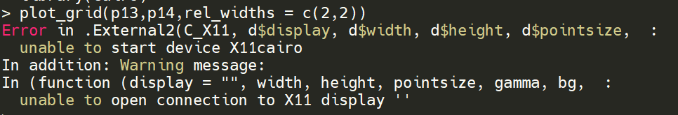
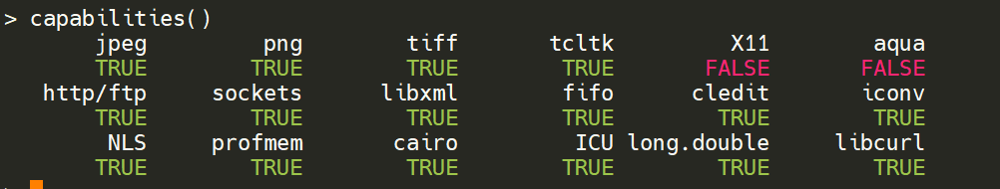
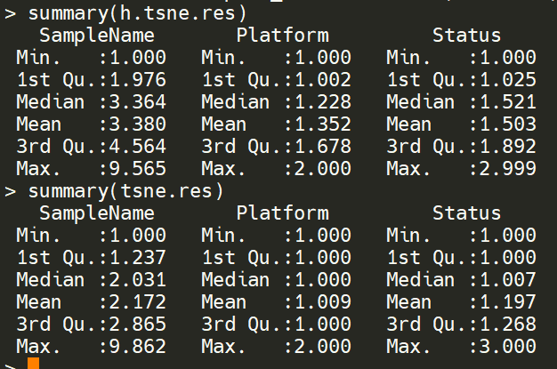
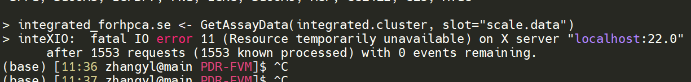

# 😣 Rep4 integration

### DoubletFinder--Singleron doublet rate chosen

p1-blood: 0.037\*8916=329

p1-ERM: 0.01\*3097=30

p2-blood: 0.04\*9595=382

p2-ERM: 589

0630-blood: 0.03\*8603=258

0630-ERM: 0.0075\*2520=18

0609-blood: 0.048\*11865=569

0609-ERM: 0.002\*1255=2

**Totle: 1796**

### 去批次方法比较

\[2020-Genome Bio.-A benchmark of batch-effect correction methods for single-cell RNA sequencing data]\([https://genomebiology.biomedcentral.com/articles/10.1186/s13059-019-1850-9](https://genomebiology.biomedcentral.com/articles/10.1186/s13059-019-1850-9))

作者基于10个人和鼠的dataset，使用t-SNE和UMAP可视化技术，结合kBET、 LISI、 ASW、ARI 和DEG等基准度量，来评估对14种去批次效应算法的批次效应校正结果。

.png>)

### 不要靠近kBET 会变得不幸

基于奇异值降解的基础上进行降维

算法的主要假设是 如果临近样本的子集标签分布与完整数据集的分布相同，则表明该重复实验能够很好的混合，相反，在存在批次效应下，生物学重复将会在整个数据集中产生批次标签的倾斜分布。KBET 通过采用卡方分布检测固定大小的随机邻域从而确定它们是否很好的被混合了。然后是得到一个二进制的结果用来计算后续的拒绝率，这表明，拒绝率越低样本混合的越好。

.png>)

### LISI

[https://github.com/immunogenomics/LISI](https://github.com/immunogenomics/LISI)

> Learn more about how we use LISI to measure single cell integration methods in the Harmony paper: Korsunsky, I. et al. [Fast, sensitive and accurate integration of single-cell data with Harmony.](https://www.nature.com/articles/s41592-019-0619-0) Nat. Methods (2019)

局部辛普森指数 。LISI主要通过具有固定的复杂度的局部距离分布选择临近的邻居。临近值的选择然后用于计算辛普森指数多样性，这是这个邻域呈现出来的有效类型数，指数通过用来计算批次标签，接近于期待批次数的分数，表明批次混合效果好。

### Harmony给爷爬

.png>)

[https://github.com/immunogenomics/harmony/pull/134](https://github.com/immunogenomics/harmony/pull/134)

要先call `library(Rcpp)`和`library(rlang)`

新版已经fix

### X11 connection error

stackexchange上的法子都不管用，需要root装依赖？无所谓了随便吧，反正rmd能输出就行

### Comparison between Harmony & Seurat integration

* harmony

.png>)

* Seurat

.png>)

.png>)

* Seurat is better than harmony in this situation

### scclusteval

**Evaluating single-cell cluster stability using the Jaccard similarity index**

[https://academic.oup.com/bioinformatics/article/37/15/2212/5962080](https://academic.oup.com/bioinformatics/article/37/15/2212/5962080)

[https://github.com/crazyhottommy/scclusteval](https://github.com/crazyhottommy/scclusteval)

do it later

### 哈？？？？？啥玩意儿

### 注释用哪个assays

.png>)

我觉着要用SCT

### singler我吐了

.png>)

难锅，跑到97%了报错，内存不够我还能咋办，加了行`gc()`,anyway 好想用上新版single

1. redhat R-3.5.2: 只能装上1.0.1的singler
2. bytlib R-3.6.0: 装不上依赖包scuttle（调用了huangb目录下的，但是一个依赖包需要更新；本地装少libicui18n.so.58库，locate一下发现在anaconda里有，改了路径还是装不了）
3. bytlib R-4.0.2 + zhangls libpath: 调用scuttle时少依赖包sparseMatrixStats, 安装时报错C++14 standard requested but CXX14 is not defined（需要sudo）
4. bytlib R-4.0.2 + 自己装包：...................................takes like forever

### Rmd is here



\
